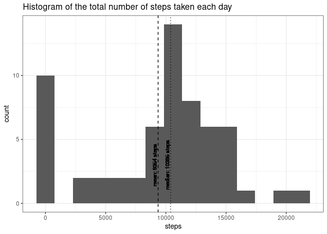
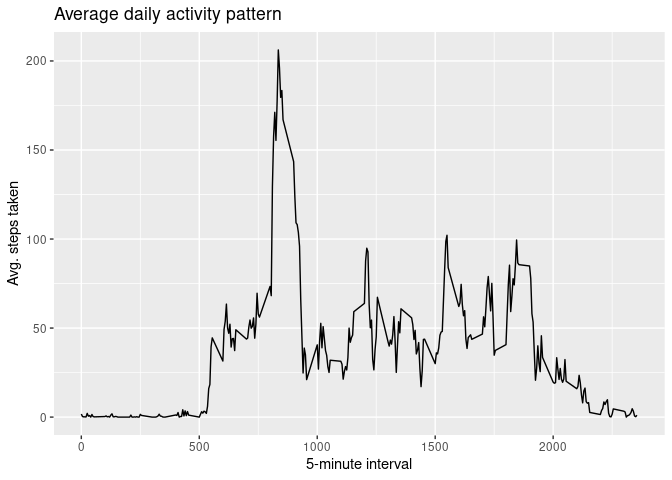
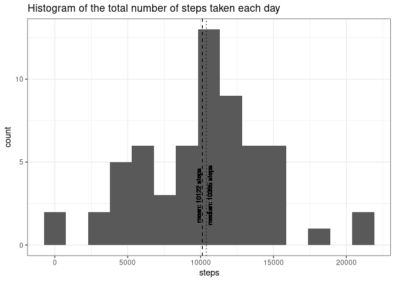
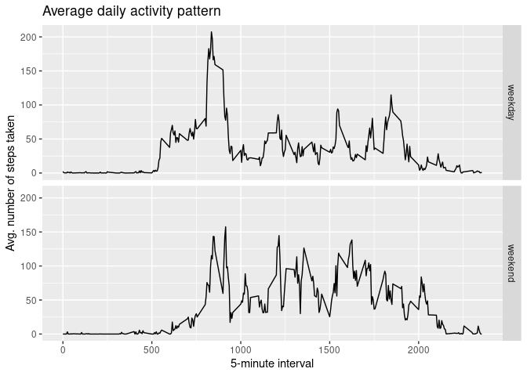

## Loading and preprocessing the data


```r
library(tidyverse)
activity <- read_csv("activity.zip")
```


## What is mean total number of steps taken per day?

```r
activity_by_day <- activity %>% 
      group_by(date) %>%
      summarise(steps = sum(steps, na.rm = TRUE )) 

mean_steps_by_day <- mean(activity_by_day$steps)
median_steps_by_day <- median(activity_by_day$steps)

activity_by_day %>%
      ggplot(aes(steps)) + 
            geom_histogram(bins = 15) +
            geom_vline(xintercept = mean_steps_by_day, linetype = "dashed") + 
            geom_text(aes(x=mean_steps_by_day, label=paste("mean:", round(mean_steps_by_day), "steps"), y=3), vjust=-0.3, colour="black", angle=90, size=3 ) +
            geom_vline(xintercept = median_steps_by_day, linetype = "dotted" ) + 
            geom_text(aes(x=median_steps_by_day, label=paste("median:", round(median_steps_by_day), "steps"), y=3), vjust=-0.3, colour="black", angle=90, size=3 ) + 
            labs(title = "Histogram of the total number of steps taken each day") +
            theme_bw()
```

<!-- -->
  
The *mean* steps taken per day is **9354.23 steps** and the *median* is **10395 steps**.

&nbsp;  
&nbsp;  

## What is the average daily activity pattern?

```r
activity_by_interval <- activity %>% 
      group_by(interval) %>%
      summarise(avg_steps = mean(steps, na.rm = TRUE))

activity_by_interval %>% 
      ggplot(aes(interval, avg_steps)) + 
            geom_line() + 
            xlab(label = "5-minute interval") + 
            ylab(label = "Avg. steps taken") + 
            labs(title = "Average daily activity pattern")
```

<!-- -->

```r
max_interval <- with(activity_by_interval,
                        interval[which.max(avg_steps)]
)                     
```
The interval **835** contains the maximum number of steps taken **206**.

&nbsp;  
&nbsp;  


## Imputing missing values


```r
missing_steps <- sum(is.na(activity$steps))
per_missing_steps <- mean(is.na(activity$steps))
```

There is **2304 missing values** (NAs) that represent **13.1% of the total**.  
&nbsp;  


```r
library(impute)
library(lubridate)
activity_weekd <- activity %>%
      mutate(date = yday(date),  weekd = wday(activity$date))


steps_nona <- impute.knn(as.matrix(activity_weekd), k=24)$data[,1]
activity_nona <- activity %>% 
      mutate(steps_nona = steps_nona)

activity_by_day <- activity_nona %>% 
      group_by(date) %>%
      summarise(steps = sum(steps_nona, na.rm = TRUE )) 
mean_steps_nona_by_day <- mean(activity_by_day$steps)
median_steps_nona_by_day <- median(activity_by_day$steps)

activity_by_day %>%
      ggplot(aes(steps)) + 
            geom_histogram(bins = 15) +
            geom_vline(xintercept = mean_steps_nona_by_day, linetype = "dashed") + 
            geom_text(aes(x=mean_steps_nona_by_day, label=paste("mean:", round(mean_steps_nona_by_day), "steps"), y=3), vjust=-0.3, colour="black", angle=90, size=3 ) +
            geom_vline(xintercept = median_steps_nona_by_day, linetype = "dotted" ) + 
            geom_text(aes(x=median_steps_nona_by_day, label=paste("median:", round(median_steps_nona_by_day), "steps"), y=3), vjust=1.1, colour="black", angle=90, size=3 ) + 
            labs(title = "Histogram of the total number of steps taken each day") +
            theme_bw()
```

<!-- -->

The *mean* steps taken per day is **10121.59 steps** and the *median* is **10395 steps**.  

Imputing the missing data had the effect of reducing the day with zero activity. And bringing the mean and median closer together.
&nbsp;  
&nbsp;  


## Are there differences in activity patterns between weekdays and weekends?

```r
activity_nona$weekend <- (wday(activity_nona$date, week_start = 1) >= 6)
activity_nona$weekend <- as.factor(activity_nona$weekend)
levels(activity_nona$weekend) <- c("weekday", "weekend")

activity_nona %>% 
      group_by(interval, weekend) %>%
      summarise(avg_steps = mean(steps_nona)) %>% 
      ggplot(aes(interval, avg_steps)) + 
            geom_line() + 
            facet_grid(weekend ~ .) +
            xlab(label = "5-minute interval") + 
            ylab(label = "Avg. number of steps taken") + 
            labs(title = "Average daily activity pattern")
```

<!-- -->

